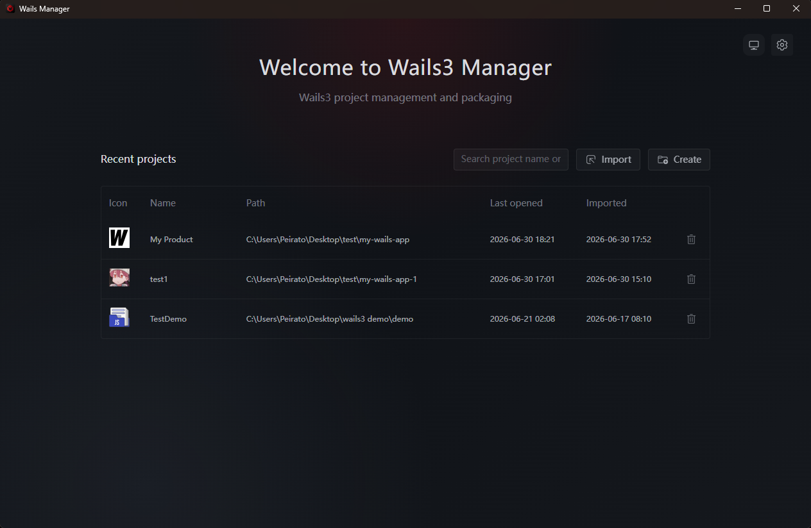

<div align="center">


# Wails3 Manager

Desktop UI for creating, configuring, building, and packaging Wails 3 apps.


**English** · [简体中文](introduce/README.zh-CN.md) · [繁體中文](introduce/README.zh-TW.md) · [日本語](introduce/README.ja-JP.md) · [한국어](introduce/README.ko-KR.md) · [Français](introduce/README.fr-FR.md) · [Deutsch](introduce/README.de-DE.md)

</div>

> [!IMPORTANT]
> Wails3 Manager is under active development and follows Wails 3 alpha releases. Windows installers are compiled on Windows, and macOS DMGs are created on macOS.

<picture>
  <source media="(prefers-color-scheme: dark)" srcset="imgs/english/dark/home.png">
  <source media="(prefers-color-scheme: light)" srcset="imgs/english/light/home.png">
  
</picture>

## What It Helps With

Wails3 Manager puts common Wails project work in one window. You can create or import a project, edit app information and icons, prepare build settings, make native packages, check the local toolchain, and watch build logs.

The convenience is simple: less switching between terminals, config files, icon tools, and installer scripts. The manager writes the related project files, runs the needed commands, and keeps package outputs together.

## Download

1. Download the build for your OS.
2. Start Wails3 Manager and check the environment page.
3. Create a new Wails 3 project or import an existing one.
4. Configure, build, and package from the workspace.

Native packaging still needs the platform tool: **Inno Setup** for Windows installers, **create-dmg** for macOS DMGs.

## Features

Main functions:

- Create projects from official, local, or remote Wails templates, then open them in the manager.
- Import existing Wails 3 projects and keep a recent-project list.
- Edit product metadata and replace the app icon; PNG icons are converted into Wails platform assets.
- Configure build name, production mode, CGO, launch program, and bundled files.
- Generate Windows Inno Setup installers and macOS DMG packages on the matching OS.
- Check Go, Node.js, npm, Wails3 CLI, Git, and packaging tools before building.
- Show live build logs and collect final outputs in `builder/release`.

## Screenshots

<table>
<tr>
<td width="50%" valign="top"><strong>Project creation</strong><br><br></td>
<td width="50%" valign="top"><strong>Project metadata</strong><br><br></td>
</tr>
<tr>
<td width="50%" valign="top"><strong>Build and packaging</strong><br><br></td>
<td width="50%" valign="top"><strong>Environment check</strong><br><br></td>
</tr>
</table>

## Development

Stack: Wails 3, Go, Vue 3, Vite, Naive UI, Pinia, Vue Router, Vue I18n, vue3-moveable.

Requirements:

- Go **1.25.0**
- Wails3 CLI compatible with `github.com/wailsapp/wails/v3 v3.0.0-alpha.96`
- Node.js and npm
- Wails platform toolchain for your OS

```bash
git clone <repository-url>
cd wails3-manager/frontend
npm install
cd ..
wails3 task dev
```

Useful commands:

```bash
cd frontend
npm run i18n:check
npm run build
cd ..
go test ./core/... ./desktop/...
wails3 task build
wails3 task release
wails3 task package
```

## Managed Project Files

Imported projects get a manager-owned `builder/` directory:

```text
builder/
├── project.json
├── packaging.json
├── backup/initial/
├── windows/inno.iss
├── macos/dmg.sh
└── release/
```

## Current Limits

- Wails 3 is still alpha.
- Native packages must be created on the target OS.
- Linux packaging is not implemented.
- Code signing, notarization, automatic publishing, cancellation, and versioned build history are not implemented.

## License

Licensed under the [Apache License 2.0](LICENSE).
