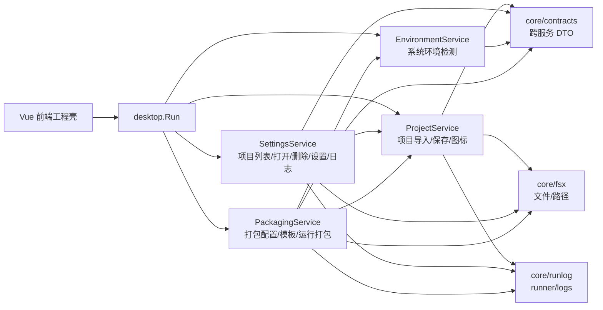
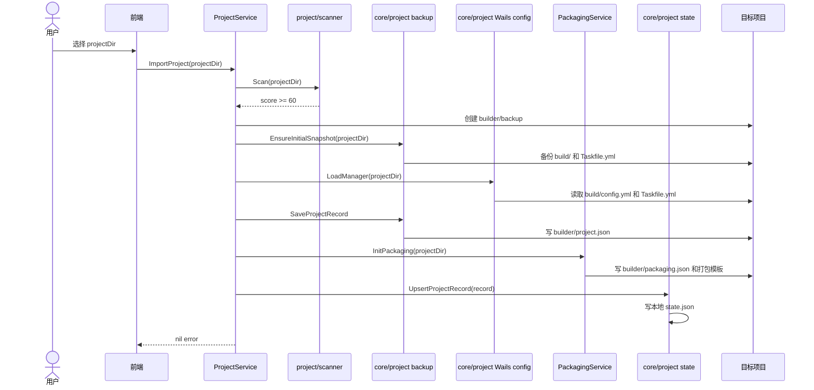
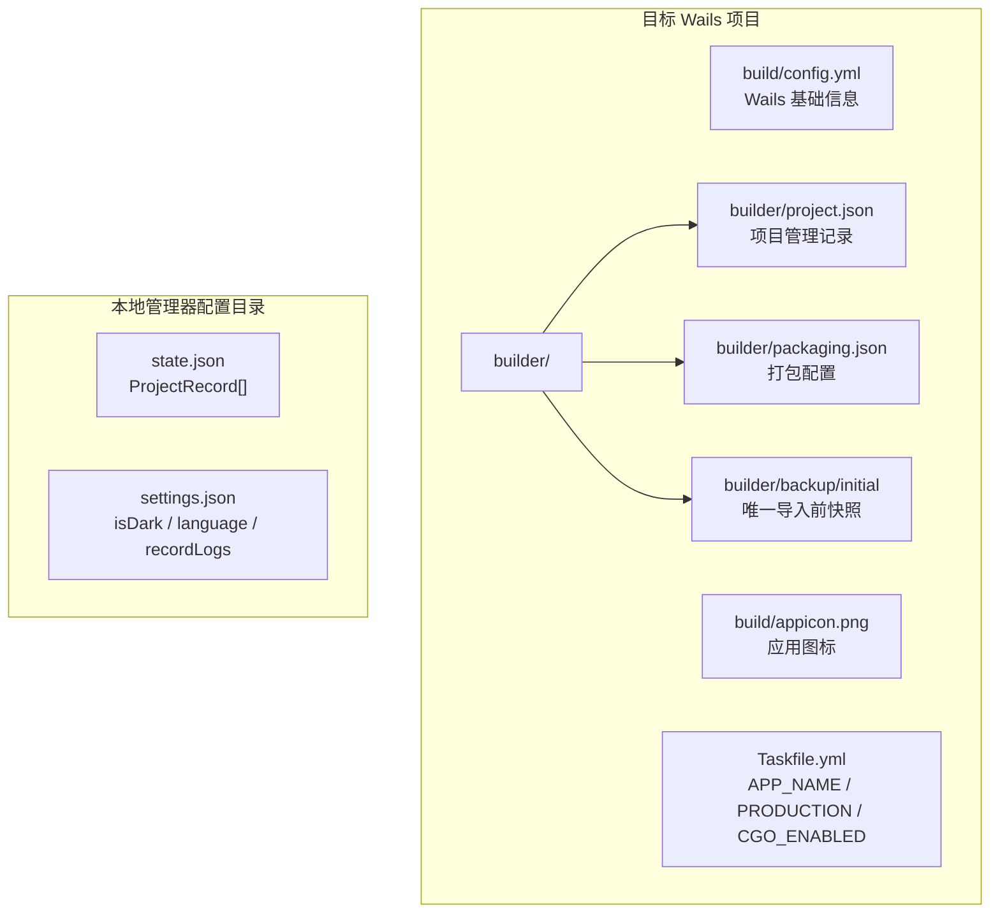
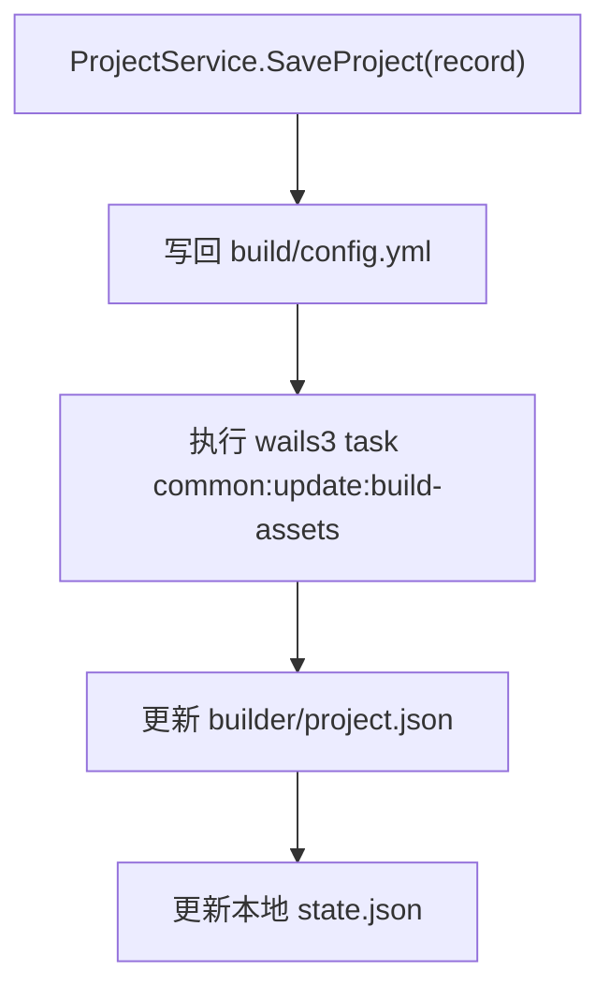
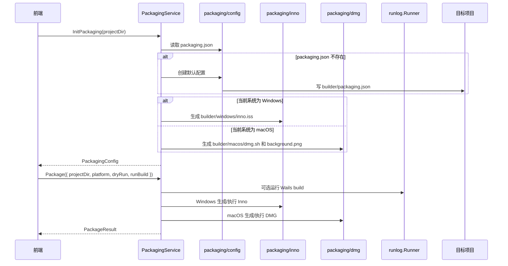
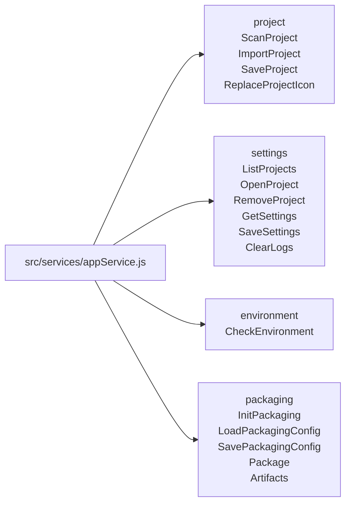

# Wails3 Manager 图文说明

这份文档用图示说明当前项目的模块边界、运行逻辑、文件写入位置和前端调用方式。它面向后续开发，重点是让你快速判断某个功能应该放在哪个模块。

## 1. 总体结构



核心原则：

- 模块允许单向读取，不允许循环 import。
- `core/project` 不 import `core/settings` 或 `core/packaging`。
- 跨模块传输的数据放在 `core/contracts`。
- 文件路径能力放在 `core/fsx`，命令执行和日志放在 `core/runlog`。
- 前端负责路径选择，后端只接收字符串路径。

## 2. 模块职责

| 模块 | 负责 | 不负责 |
| --- | --- | --- |
| `core/project` | 扫描目录、导入项目、保存 Wails 基础信息、替换图标、维护本地项目索引 | 打包配置、打包 build 参数、环境检测、主题语言设置 |
| `core/settings` | 暴露项目列表/打开/删除入口、恢复导入前快照、主题语言设置、日志读取 | 新项目导入、写 `build/config.yml`、打包运行 |
| `core/environment` | 检测 Go、Node、Wails3、Inno、create-dmg 等工具 | 写任何项目文件 |
| `core/packaging` | 初始化 `builder/packaging.json`、生成 Inno/DMG 模板、运行打包 | 修改项目基础信息、维护项目列表 |
| `core/contracts` | Wails 暴露 DTO、枚举、请求/响应结构 | 业务逻辑 |
| `core/fsx` | 文件、路径、安全复制、路径解析 | 业务决策 |
| `core/runlog` | 命令执行和内存日志 | 业务决策 |

## 3. 项目导入流程



导入会完成项目管理和默认打包初始化：

- 创建 `builder/project.json`。
- 创建 `builder/backup/initial`。
- 创建或读取 `builder/packaging.json`。
- 生成当前运行系统的默认打包模板：Windows 为 Inno，macOS 为 DMG。
- 写入本地项目列表。

## 4. 文件存储关系



两个核心配置文件不要混用：

- `builder/project.json`：项目管理模块使用。
- `builder/packaging.json`：打包模块使用。

## 5. 保存项目对象



字段同步规则：

| 前端字段 | 写入位置 |
| --- | --- |
| `record.project.wailsConfig.info.productName` | `build/config.yml` |
| `record.project.wailsConfig.info.version` | `build/config.yml`，保存时自动补 `v` 前缀 |
| `record.project.wailsConfig.info.productIdentifier` | `build/config.yml` |

`APP_NAME` / `PRODUCTION` / `CGO_ENABLED` 不再保存在 `project.json` 的 `taskVars` 中。首次初始化 packaging 时会从 Taskfile 读取旧默认值，之后以 `builder/packaging.json` 的 `build` 字段为准；默认打包构建会把这些字段作为 Task 变量和环境变量传入。

保存项目和替换图标不会生成额外备份；恢复只使用导入时创建的 `builder/backup/initial`。

## 6. 打包模块流程



打包模块会读取 `core/project` 的 `builder/project.json` 工具函数来生成当前系统的打包模板，但不会把项目基础信息写入 `packaging.json`。产品名、版本、bundleId、图标等来自 `project.json`；`build.appName` / `production` / `cgoEnabled` 是打包 build 的唯一配置源。

打包阶段不支持 before/after 脚本字段；自定义构建只通过 `builder/packaging.json` 的 `build.command` 表达。

## 7. 前端调用地图



推荐前端按业务场景调用：

```js
import { appService } from '@/services/appService'

const scan = await appService.ScanProject(projectDir)
await appService.ImportProject(projectDir)
const projects = await appService.ListProjects()
const record = await appService.OpenProject(projectDir)

record.project.wailsConfig.info.productName = 'New Name'
const saved = await appService.SaveProject(record)

const env = await appService.CheckEnvironment()
const packaging = await appService.InitPackaging(projectDir)
```

也可以使用分组调用，代码更清晰：

```js
const projects = await appService.settings.ListProjects()
const report = await appService.environment.CheckEnvironment()
const cfg = await appService.packaging.LoadPackagingConfig(projectDir)
```

## 8. 常见开发判断

| 需求 | 应放模块 |
| --- | --- |
| 新增项目扫描规则 | `core/project/scanner` |
| 新增项目基础字段同步 | `core/project` 和 `core/contracts` |
| 管理最近打开项目 | `core/project`，由 `SettingsService` 暴露给前端 |
| 主题、语言、日志开关 | `core/settings` |
| 检测一个外部工具版本 | `core/environment` |
| 新增 Windows 安装器字段 | `core/packaging` 和 `core/contracts` |
| 修改 DMG 背景、窗口尺寸、图标位置 | `core/packaging/dmg` |
| 新增跨模块 DTO | `core/contracts` |
| 新增文件复制、路径、安全删除等通用能力 | `core/fsx` |

如果一个功能需要两个业务模块互相引用，先检查能否改成单向读取；实在需要共享数据时放到 `core/contracts`。
