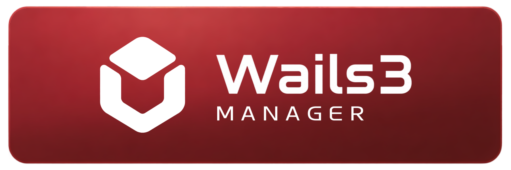
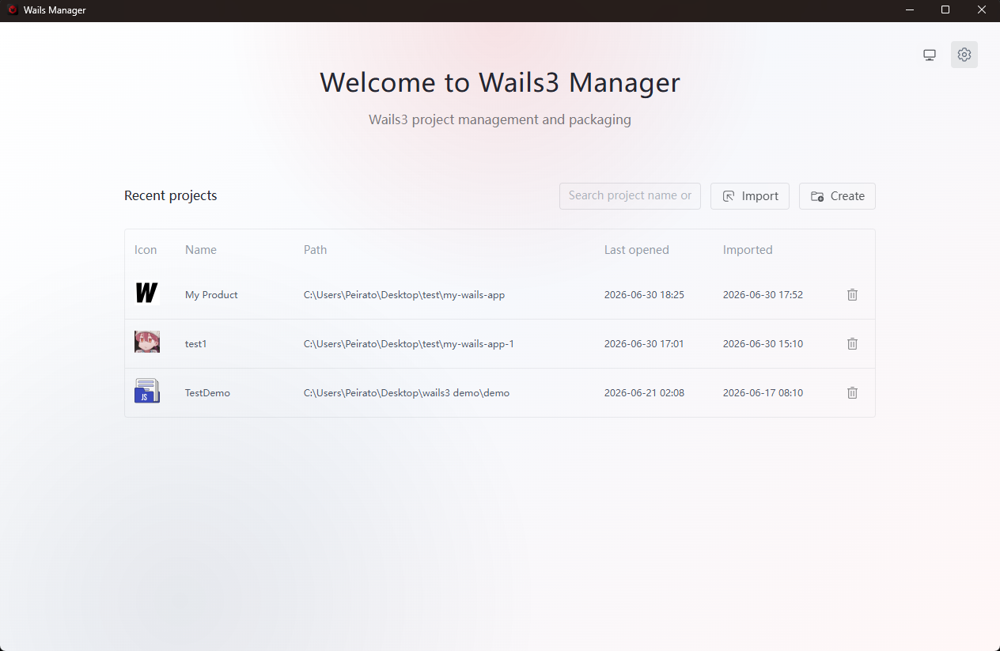
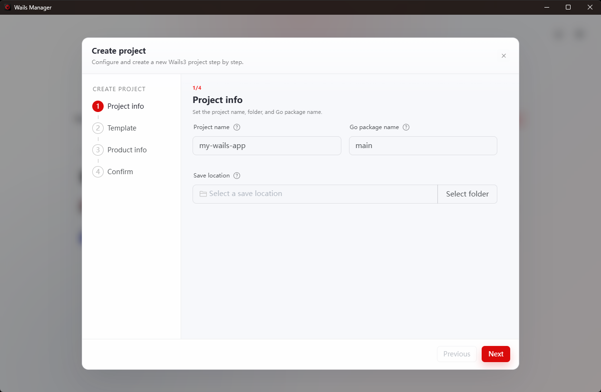
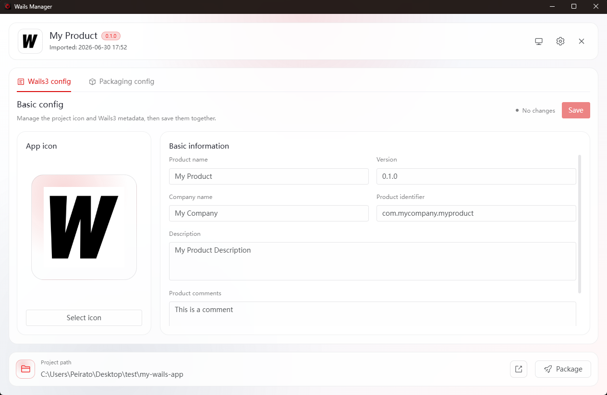
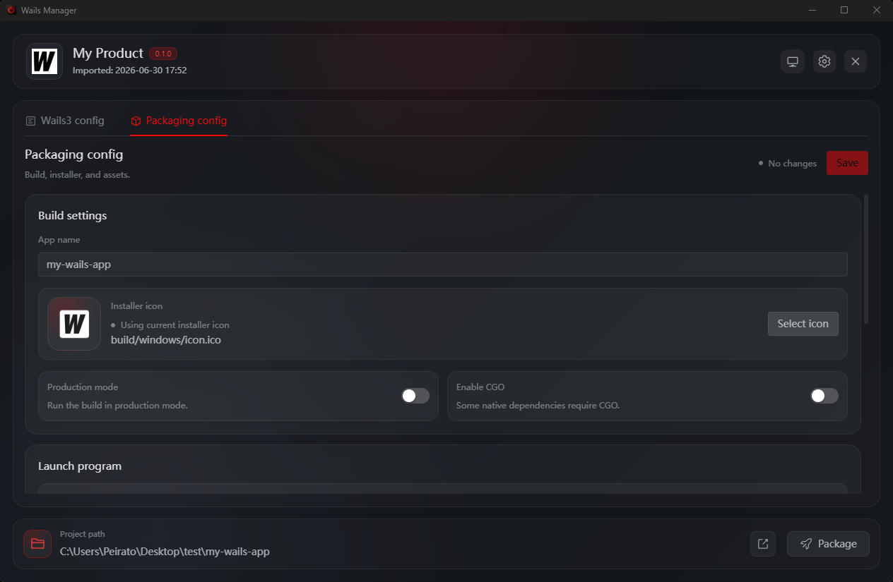
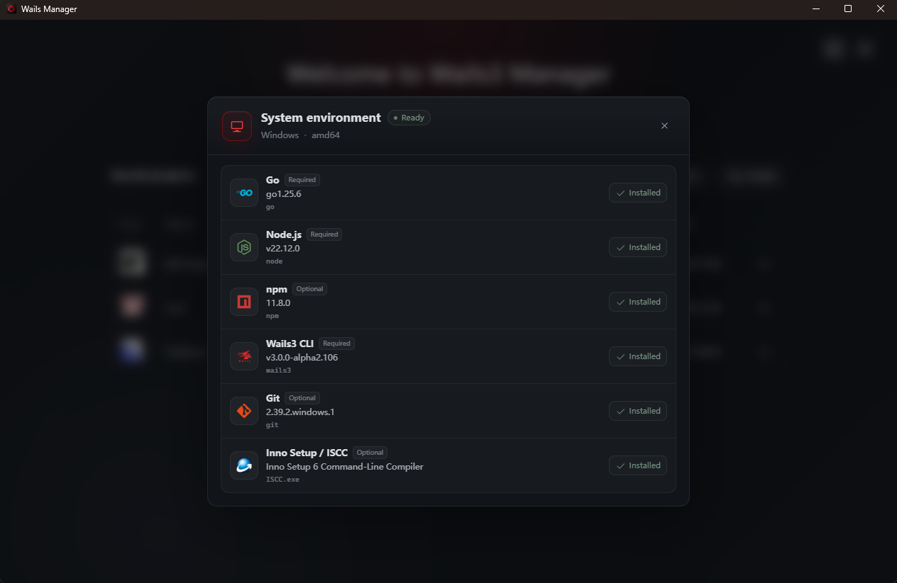

<div align="center">


# Wails3 Manager

Interface desktop pour créer, configurer, compiler et empaqueter des applications Wails 3.



[English](../README.md) · [简体中文](README.zh-CN.md) · [繁體中文](README.zh-TW.md) · [日本語](README.ja-JP.md) · [한국어](README.ko-KR.md) · **Français** · [Deutsch](README.de-DE.md)

</div>

> [!IMPORTANT]
> Wails3 Manager est en développement et suit les versions alpha de Wails 3. Les installateurs Windows sont compilés sous Windows, et les DMG macOS sont créés sous macOS.

<picture>
  <source media="(prefers-color-scheme: dark)" srcset="../imgs/english/dark/home.png">
  <source media="(prefers-color-scheme: light)" srcset="../imgs/english/light/home.png">
  
</picture>

## Ce que ça apporte

Wails3 Manager regroupe les tâches courantes d'un projet Wails dans une seule fenêtre. Vous pouvez créer ou importer un projet, modifier les informations et l'icône de l'app, préparer le build, créer des paquets natifs, vérifier les outils locaux et lire les logs.

Le gain est direct : moins d'allers-retours entre terminal, fichiers de configuration, outils d'icônes et scripts d'installation. Le manager écrit les fichiers utiles, lance les commandes nécessaires et garde les sorties de packaging au même endroit.

## Télécharger

Pour une utilisation normale, prenez une version publiée :

**[Télécharger la dernière version](../../../releases/latest)** · [Toutes les versions](../../../releases)

1. Téléchargez le build adapté à votre système.
2. Lancez Wails3 Manager et vérifiez la page d'environnement.
3. Créez un projet Wails 3 ou importez un projet existant.
4. Configurez, compilez et empaquetez depuis l'espace de travail.

Le packaging natif demande toujours l'outil de plateforme : **Inno Setup** pour Windows, **create-dmg** pour macOS.

## Fonctionnalités

Fonctions principales :

- Créer un projet depuis un modèle Wails officiel, local ou distant, puis l'ouvrir dans le manager.
- Importer un projet Wails 3 existant et garder une liste des projets récents.
- Modifier les informations produit et remplacer l'icône ; les PNG sont convertis en ressources Wails.
- Configurer le nom de build, le mode production, CGO, l'exécutable et les fichiers inclus.
- Générer des installateurs Inno Setup Windows et des DMG macOS sur l'OS correspondant.
- Vérifier Go, Node.js, npm, Wails3 CLI, Git et les outils de packaging avant le build.
- Afficher les logs de build et regrouper les sorties finales dans `builder/release`.

## Captures

<table>
<tr>
<td width="50%" valign="top"><strong>Project creation</strong><br><br></td>
<td width="50%" valign="top"><strong>Project metadata</strong><br><br></td>
</tr>
<tr>
<td width="50%" valign="top"><strong>Build and packaging</strong><br><br></td>
<td width="50%" valign="top"><strong>Environment check</strong><br><br></td>
</tr>
</table>

## Développement

Stack : Wails 3, Go, Vue 3, Vite, Naive UI, Pinia, Vue Router, Vue I18n, vue3-moveable.

Prérequis :

- Go **1.25.0**
- CLI Wails3 compatible avec `github.com/wailsapp/wails/v3 v3.0.0-alpha.96`
- Node.js et npm
- Toolchain Wails de votre OS

```bash
git clone <repository-url>
cd wails3-manager/frontend
npm install
cd ..
wails3 task dev
```

Commandes utiles :

```bash
cd frontend
npm run i18n:check
npm run build
cd ..
go test ./core/... ./desktop/...
wails3 task build
wails3 task release
wails3 task package
```

## Fichiers de projet gérés

Les projets importés reçoivent un dossier `builder/` :

```text
builder/
├── project.json
├── packaging.json
├── backup/initial/
├── windows/inno.iss
├── macos/dmg.sh
└── release/
```

## Limites actuelles

- Wails 3 est encore en alpha.
- Les paquets natifs doivent être créés sur l'OS cible.
- Le packaging Linux n'est pas implémenté.
- Signature, notarisation, publication automatique, annulation et historique versionné ne sont pas implémentés.
- La restauration utilise un seul snapshot créé à l'import.

## Licence

Sous licence [Apache License 2.0](../LICENSE).
