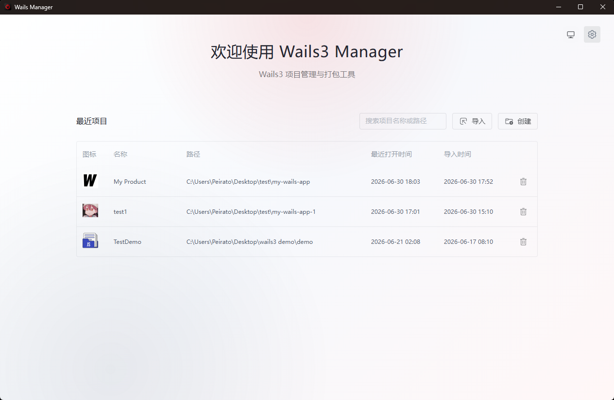
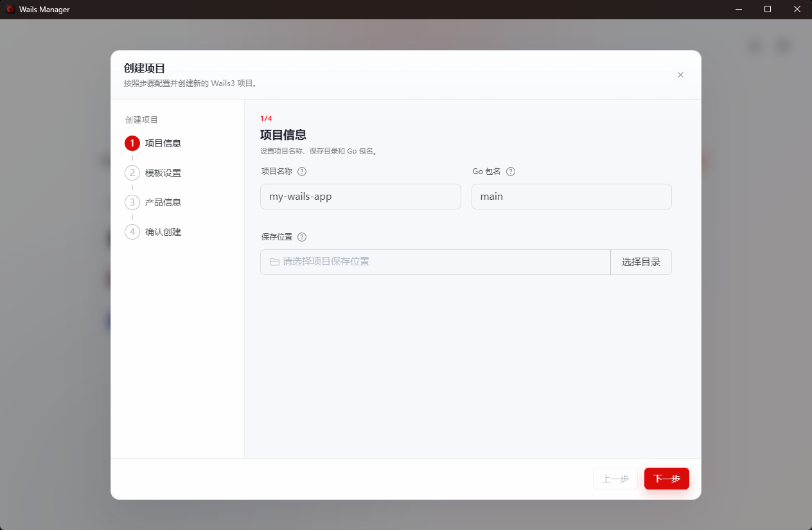
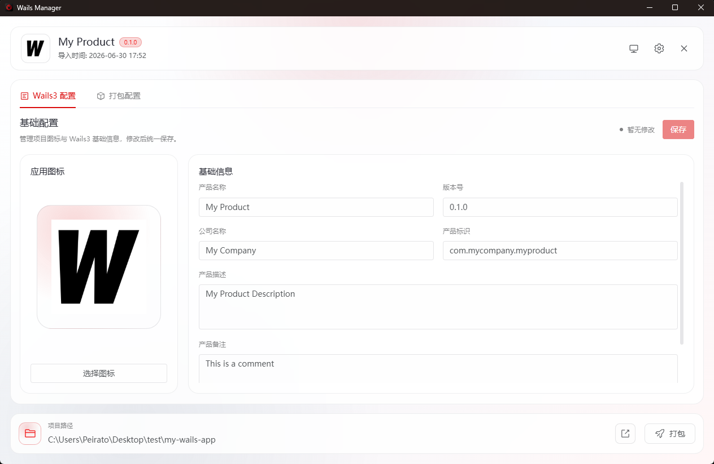
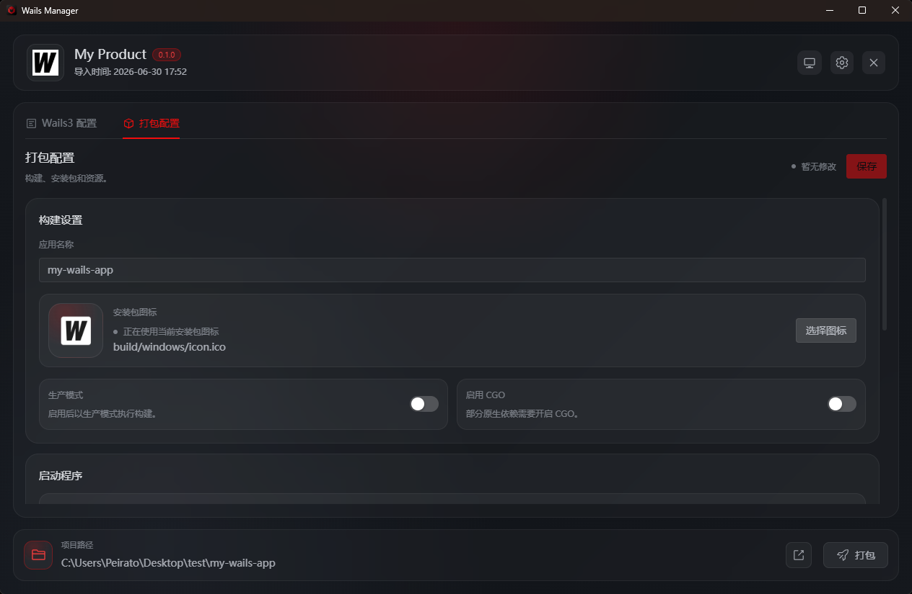
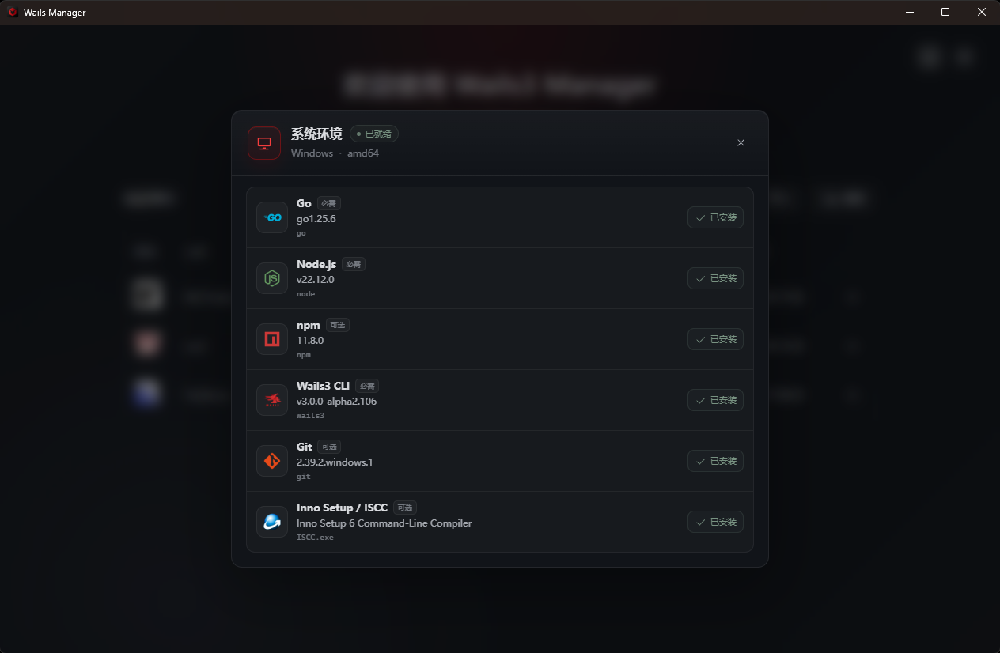

<div align="center">


# Wails3 Manager

用桌面界面创建、配置、构建和打包 Wails 3 应用。


[English](../README.md) · **简体中文** · [繁體中文](README.zh-TW.md) · [日本語](README.ja-JP.md) · [한국어](README.ko-KR.md) · [Français](README.fr-FR.md) · [Deutsch](README.de-DE.md)

</div>

> [!IMPORTANT]
> Wails3 Manager 仍在开发中，并跟随 Wails 3 Alpha 版本变化。Windows 安装包需要在 Windows 上编译，macOS DMG 需要在 macOS 上创建。

<picture>
  <source media="(prefers-color-scheme: dark)" srcset="../imgs/chinese/dark/home.png">
  <source media="(prefers-color-scheme: light)" srcset="../imgs/chinese/light/home.png">
  
</picture>

## 它能帮什么忙

Wails3 Manager 把常见的 Wails 项目操作放到一个窗口里。你可以创建或导入项目，编辑应用信息和图标，准备构建配置，生成原生安装包，检查本机工具链，并查看构建日志。

它带来的便利很直接：少切终端，少手改配置文件，少处理图标和安装脚本。管理器会写入相关项目文件、执行需要的命令，并把安装包产物放到一起。

## 下载

1. 下载与当前系统匹配的版本。
2. 启动 Wails3 Manager，并检查开发环境。
3. 创建新项目，或导入已有 Wails 3 项目。
4. 在工作台完成配置、构建和打包。

使用原生打包功能时，需要安装对应工具：Windows 使用 **Inno Setup**，macOS 使用 **create-dmg**。

## 功能

主要功能：

- 从官方、本地或远程 Wails 模板创建项目，并直接打开到工作台。
- 导入已有 Wails 3 项目，并保留最近项目列表。
- 编辑产品信息并替换应用图标；PNG 图标会转换成 Wails 平台资源。
- 配置构建名称、生产模式、CGO、启动程序和附加文件。
- 在对应系统上生成 Windows Inno Setup 安装包和 macOS DMG。
- 构建前检查 Go、Node.js、npm、Wails3 CLI、Git 和打包工具。
- 显示实时构建日志，并把最终产物收集到 `builder/release`。

## 界面截图

<table>
<tr>
<td width="50%" valign="top"><strong>项目创建</strong><br><br></td>
<td width="50%" valign="top"><strong>项目信息</strong><br><br></td>
</tr>
<tr>
<td width="50%" valign="top"><strong>构建与打包</strong><br><br></td>
<td width="50%" valign="top"><strong>环境检查</strong><br><br></td>
</tr>
</table>

## 开发

技术栈：Wails 3、Go、Vue 3、Vite、Naive UI、Pinia、Vue Router、Vue I18n、vue3-moveable。

开发要求：

- Go **1.25.0**
- 与 `github.com/wailsapp/wails/v3 v3.0.0-alpha.96` 兼容的 Wails3 CLI
- Node.js 和 npm
- 当前系统所需的 Wails 平台工具链

```bash
git clone <你的仓库地址>
cd wails3-manager/frontend
npm install
cd ..
wails3 task dev
```

常用命令：

```bash
cd frontend
npm run i18n:check
npm run build
cd ..
go test ./core/... ./desktop/...
wails3 task build
wails3 task release
wails3 task package
```

## 被管理项目文件

导入项目后，应用会在目标项目中创建 `builder/` 目录：

```text
builder/
├── project.json
├── packaging.json
├── backup/initial/
├── windows/inno.iss
├── macos/dmg.sh
└── release/
```

## 当前限制

- Wails 3 仍处于 Alpha 阶段。
- 原生安装包必须在目标系统上创建。
- Linux 安装包尚未实现。
- 代码签名、公证、自动发布、任务取消和版本化构建历史尚未实现。

## 许可证

Wails3 Manager 基于 [Apache License 2.0](../LICENSE) 开源。
